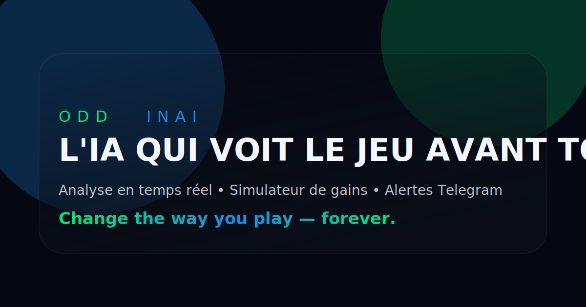

# OddinAI — Landing Page

Landing page premium et animée pour OddinAI, une application Telegram alimentée par l'IA qui analyse les paris sportifs en temps réel. Design inspiré d'OddsJam, Revolut et Figma avec un thème dark blue + neon green.

## ⚙️ Stack & principales features

- **Next.js 15 (App Router)** + **TypeScript**
- **Tailwind CSS** customisé (palette night/azure/electric, animations float/marquee/dash)
- **Framer Motion** pour toutes les entrées en scène, carrousels, parallax et compteurs
- **Sections** : Hero, IA temps réel, chiffres, simulateur de gains, avantages, plans, témoignages, FAQ, À propos, roadmap, footer RGPD
- **Simulateur interactif** (sliders capital/durée/paris, calcul ROI via \( (1 + stake \times r)^N \)) avec courbe SVG animée et particules
- **Préparation Stripe** : CTA "Commencer" sur les cartes tarifs, architecture front prête pour intégration checkout
- **Accessibilité** : aria-live sur le simulateur, accordéon FAQ clavier, contrastes AA+

## 🚀 Lancer le projet

```bash
npm install --legacy-peer-deps
npm run dev
# build production
npm run build && npm start
```

> `--legacy-peer-deps` est requis car Next 15 utilise React 19 RC, non encore aligné avec les peer deps de Framer Motion.

Visitez `http://localhost:3000` pour découvrir la landing.

## 🧱 Architecture

- `app/page.tsx` assemble les sections
- `components/sections/*` : chaque bloc majeur (Hero, Realtime, Stats, Simulator, Features, Pricing, Testimonials, FAQ, About, Roadmap)
- `components/ui` : primitives partagées (Heading animé, GlowCard)
- `app/globals.css` : base dark premium, boutons glow, sliders custom, grille de fond
- `public/og.svg` : visuel OG utilisé dans les métadonnées (`app/layout.tsx`)

## 📈 Simulateur de gains

- Hypothèses fixes : win rate 66 %, cotes moyennes 1.62, stake 7 % (compounding)
- ROI par pari : `r = WR × (odds - 1) - (1 - WR) ≈ 6,92 %`
- Bankroll : `capital_final = capital_initial × (1 + stake × r)^(nombre_de_paris)`
- Sliders (avec debounce 120 ms) : capital 100–10 000 €, durée 1–12 mois, 0.5–5 paris/jour
- Sorties : total de paris, ROI, gains €, courbe SVG animée + particules quand un nouveau pic est atteint

## ✨ Animations & micro-interactions

- Hero : halo radial, CTA pulsée, mockup iPhone flottant et notifications cycliques
- Data stream : ticker numérique horizontal + cartes focus
- Stats : anneaux SVG avec stroke-dash animés & count-up
- Pricing : toggle mensuel/annuel avec badge Pro recommandé
- Testimonials : carousel auto avec AnimatePresence
- FAQ : accordéons Framer Motion (hauteur + rotation chevron)
- Roadmap : timeline verticale avec draw animation

## 🧪 Tests & tâches

- `npm run lint` pour vérifier la qualité du code
- `npm run build` pour s'assurer que Next.js compile avant déploiement

## 📄 Notes

- CTA principal pointe vers un placeholder Telegram (`https://t.me/oddinai`).
- L'OG image et les métadonnées SEO sont configurées dans `app/layout.tsx`.
- Les liens Mentions / CGU / Jeu responsable sont actuellement des placeholders (à relier aux vraies pages/legal docs).
